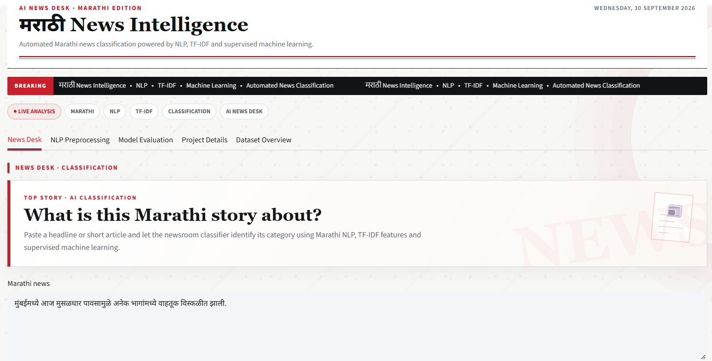
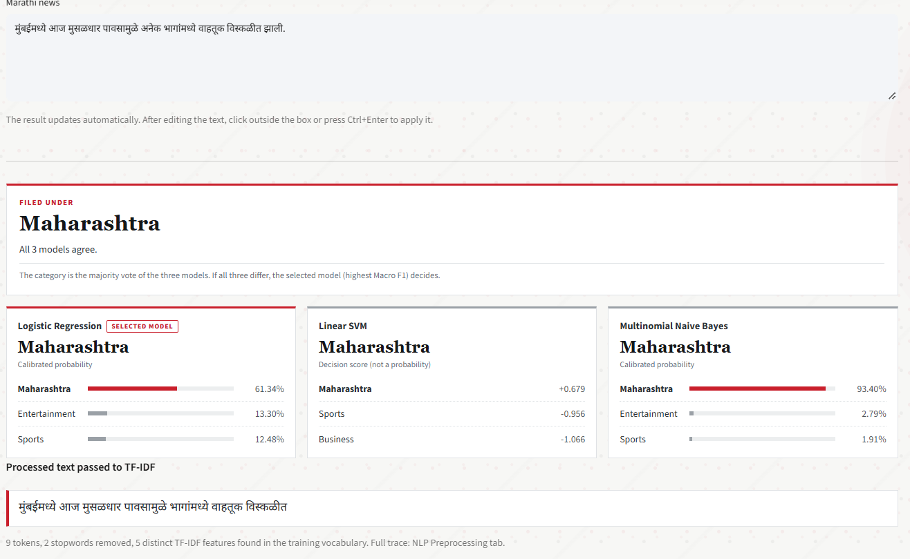
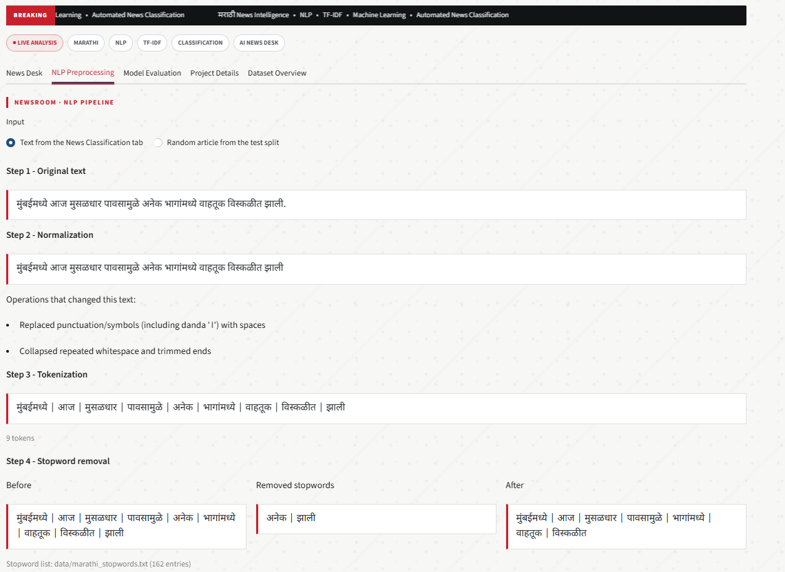
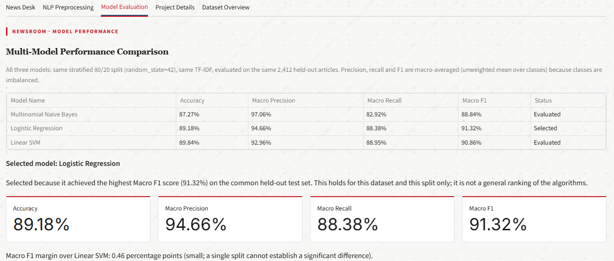
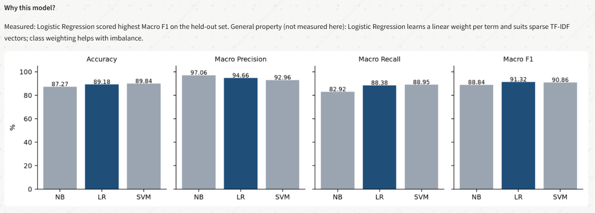
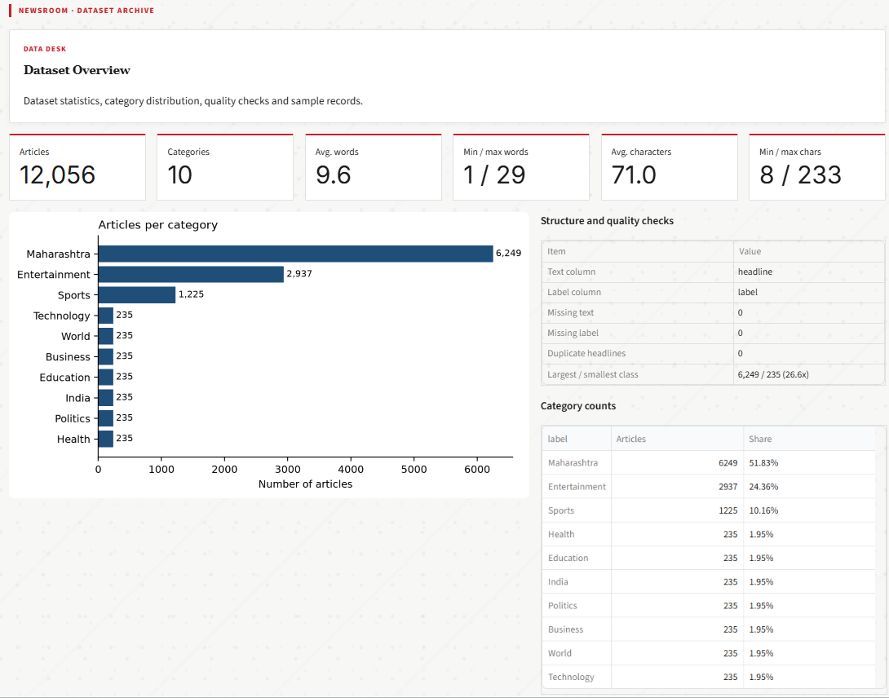

# Marathi News Classification NLP

Classify Marathi news headlines into categories using TF-IDF features and supervised machine learning (Multinomial Naive Bayes, Logistic Regression, Linear SVM). Streamlit dashboard for demonstration and viva.

## Objective
Predict the news category of a Marathi text and make every NLP step and evaluation number inspectable.

## Dataset
`data/combined_train.csv` (unchanged copy of the supplied file). Columns are auto-detected: text column = `headline`, label column = `label`. 12,056 records, 10 categories (Business, Education, Entertainment, Health, India, Maharashtra, Politics, Sports, Technology, World), no missing values, no duplicate headlines. Classes are strongly imbalanced: Maharashtra 6,249; Entertainment 2,937; Sports 1,225; the other seven 235 each. Texts are short headlines (mean 9.6 words).

## NLP Pipeline
Raw text -> normalization -> tokenization -> stopword removal -> TF-IDF -> classifier -> category.
One implementation (`src/preprocessing.py`) is used by the UI, the TF-IDF vectorizer and prediction. `tests/verify.py` checks that the UI trace equals the vectorizer's tokens.

## Preprocessing
Unicode NFC; zero-width character removal; Devanagari digits -> ASCII digits; Latin lower-casing; punctuation (incl. danda) -> space; whitespace collapsing; Devanagari-aware regex tokenization; stopword removal using `data/marathi_stopwords.txt` (editable; retraining is triggered automatically when it changes).
**Not implemented:** stemming/lemmatization. No validated Marathi stemmer was available, and Marathi is agglutinative (e.g. postpositions fused to nouns), so inflected forms remain separate vocabulary items.

## Feature Extraction
`TfidfVectorizer`: word unigrams + bigrams, `min_df=2`, sublinear TF, L2 norm. Fitted on the training split only.

## Machine Learning Algorithms
Multinomial NB (alpha=1.0), Logistic Regression (C=1.0, `class_weight="balanced"`), LinearSVC (C=1.0, `class_weight="balanced"`). Library-default hyperparameters; nothing was tuned on the test set. NB has no class-weight option.

## Evaluation Metrics
Accuracy and macro-averaged precision, recall and F1 on a stratified 80/20 split (`random_state=42`) shared by all models.

## Model Selection
Highest Macro F1 on the common test set (ties: accuracy). Determined at run time, not hard-coded. "Best" applies only to this dataset and split.

## Results
Generated from the actual run (`artifacts/results.json`; the app recomputes them if the data or code changes):

| Model | Accuracy | Macro Precision | Macro Recall | Macro F1 | Status |
|---|---|---|---|---|---|
| Multinomial Naive Bayes | 87.27% | 97.06% | 82.92% | 88.84% | Evaluated |
| Logistic Regression | 89.18% | 94.66% | 88.38% | 91.32% | Selected |
| Linear SVM | 89.84% | 92.96% | 88.95% | 90.86% | Evaluated |

Differences of about one percentage point on a single split are not evidence of a significant difference.

## How to Run
```
pip install -r requirements.txt
streamlit run app.py
python tests/verify.py
```
The first launch trains and caches the models in `artifacts/`.

## Project Structure
`app.py` UI | `src/` preprocessing, feature_extraction, models, evaluation, prediction | `utils/` data_loader, plots | `data/` dataset + stopwords | `tests/verify.py` | `artifacts/` cached models

## Future Improvements
Character n-gram TF-IDF for Marathi morphology, k-fold cross-validation, hyperparameter search on a validation split, calibrated SVM, a Marathi morphological analyzer, MarathiBERT / IndicBERT as a comparison.

## Application Screenshots

### 1. Homepage
The main interface of the Marathi News Classification application.



### 2. News Classification
The application processes the entered Marathi news article and predicts its category.



### 3. Text Preprocessing
Displays the NLP preprocessing steps applied to the input news text.



### 4. Model Evaluation
Shows the evaluation results of the classification models.



### 5. Model Comparison
Compares the performance of the different machine learning models using evaluation metrics.



### 6. Dataset Details
Provides information about the dataset used for training and evaluation.


